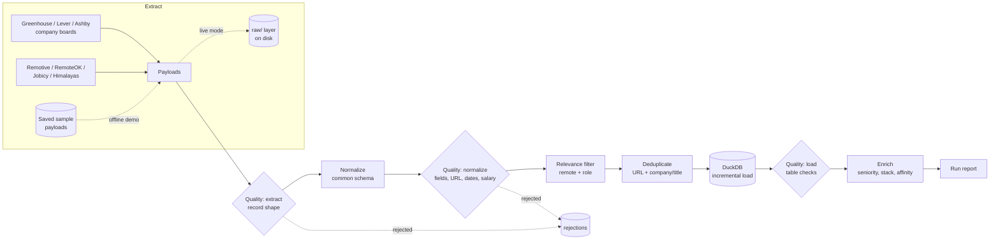

# query-jobs-pipeline

**Batch data pipeline for remote Data Engineer job postings: ingests seven public job APIs, validates every record, deduplicates across sources and runs, loads incrementally into DuckDB, and optionally enriches each job with AI.**


> **About this repository: a lite version**
>
> This is a **lite, public version of query-jobs**, a private desktop app I have been developing since **September 2026**. The private app is much broader: a full interface, more data sources, resume tailoring per job and application tracking.
>
> Only the **data pipeline** was extracted for this repository: ingestion, normalization, deduplication, storage and enrichment, reimplemented cleanly with the same design. It contains no personal data. The example profile used for scoring is **fictional**, and the sample payloads use fictional companies.
>
> It was built **with AI assistance (Claude)**. The architecture and the design decisions come from the private project.

---

## The problem

Remote Data Engineer jobs are spread over many places: companies' own job boards (Greenhouse, Lever, Ashby) and aggregators that copy those postings. The data is messy:
- The same job appears on several sites, with different titles ("Senior Data Engineer (Remote - LATAM)" vs "Senior Data Engineer"), company spellings ("Northwind Data, Inc.") and tracking parameters in the URL.
- Some records are broken: a missing URL, a date in the future, a salary range where the minimum is above the maximum.
- Every day the same jobs come back, mixed with new ones.

This pipeline turns that into one clean, deduplicated table that grows incrementally. Each run ends with a report of what is new, what was rejected and why, and which jobs best match a candidate profile.

## Architecture



| Stage | What happens | Module |
|---|---|---|
| Extract | Fetch each API (live), or read saved payloads (demo); live payloads are kept on disk as a raw layer | `sources/`, `http.py` |
| Quality: extract | Each raw record must be an object with the keys its parser needs | `quality.py` |
| Normalize | Map each source to one `Posting` schema: title, company, location, work mode, salary, date, URL | `sources/` |
| Quality: normalize | Required fields, valid `http(s)` URL, plausible date, coherent salary and currency | `quality.py` |
| Filter | Keep remote postings for the configured roles; the rest is counted as filtered, not rejected | `relevance.py` |
| Deduplicate | Group the same job across sources (union-find over canonical URL and company + title) | `dedup.py` |
| Load | Match each group to an existing job or insert it; record source links, rejections and per-source stats | `store.py` |
| Quality: load | Consistency checks on the stored tables; a failure marks the run as failed | `store.py` |
| Enrich | Seniority, tech stack and affinity score, for new or changed jobs only | `enrich.py` |
| Report | New jobs ranked by affinity, stats by source, stack demand, rejections by rule | `report.py` |

### Sources

All seven are public JSON APIs. There is no HTML scraping and no browser automation.

| Source | Type | Endpoint | What its terms ask |
|---|---|---|---|
| Greenhouse | Company board (ATS) | `boards-api.greenhouse.io/v1/boards/{slug}/jobs` | Public board API |
| Lever | Company board (ATS) | `api.lever.co/v0/postings/{slug}` | Public postings API |
| Ashby | Company board (ATS) | `api.ashbyhq.com/posting-api/job-board/{slug}` | Public job board API |
| Remotive | Aggregator | `remotive.com/api/remote-jobs` | Light use and a link back |
| RemoteOK | Aggregator | `remoteok.com/api` | Link back and mention RemoteOK |
| Jobicy | Aggregator | `jobicy.com/api/v2/remote-jobs` | Credit Jobicy and link to the original job |
| Himalayas | Aggregator | `himalayas.app/jobs/api/search` | Light use and a link to the posting |

Every stored job keeps the original posting URL from each source that published it.

## Design decisions

### DuckDB over SQLite
The workload is analytical. Writes are batch loads once per run; reads are aggregations for the report: counts by source, `UNNEST` of the stack lists, top-N with joins. DuckDB is built for that. It also stores lists natively (`stack VARCHAR[]`), supports `INSERT ... ON CONFLICT` for the link table, and is a single embedded file with no server, exactly like SQLite.

SQLite would be the better choice for many concurrent small writes (an app's operational database), which this is not.

### Fetching is separate from parsing
Each source has three methods: `fetch` (live only), `records` (find the jobs inside a payload) and `normalize` (map one record to the common schema). The offline demo, the tests and live runs therefore go through exactly the same parsers; only where the payloads come from changes.

In live mode every raw response is written to `output/raw/run-N/`, so a run can be audited or reprocessed without calling the APIs again.

### Quality rules reject; they never repair
A record that breaks a rule is not guessed at:
- A missing URL is not rebuilt.
- An inverted salary range is not swapped.
- A future date is not clamped.

The record is stored in `rejections` with its stage, rule and an example, and the report lists them by rule. A broken record visible in a report is better than a silently "fixed" one that is wrong.

Rules run at three stages:
- **extract** checks the raw shape.
- **normalize** checks the meaning: required fields, URL, date, salary.
- **load** checks the stored tables: no orphan links, no duplicate canonical URLs. A failure at this stage marks the run as failed.

### Filtering is not rejecting
An on-site office manager posting is valid data, just not what this pipeline looks for. Relevance (remote plus a matching role) is counted separately as `filtered`, so the rejection report only shows real data problems.

### Deduplication: two keys, union-find, source priority
Two postings are the same job when they share either key:
- **Canonical URL:** lowercase host without `www`, no fragment or trailing slash, no tracking parameters (`utm_*`, `gh_src`, `lever-source`, ...), remaining parameters sorted.
- **Dedup key:** company without legal suffixes (`Inc.`, `LLC`, `S.A.S.`...) plus title without posting notes ("(Remote - LATAM)") and noise words.

Postings are grouped with **union-find** over both keys. If A shares a URL with B and B shares a key with C, all three are one job.

The merged job takes each field from the **highest-priority source** that has it. The employer's own ATS board comes first and aggregators fill the gaps, because aggregators copy the employer's posting and sometimes lose details.

A dedup key without a company is never used: a title alone is too weak to merge on.

### Incremental load
Each group is matched to a stored job in three steps:
1. a known `(source, source_job_id)`;
2. the canonical URL;
3. the dedup key seen within the last **60 days** (a company re-posting the same title after that is treated as a new opening).

A match only refreshes `last_seen_at` and **fills fields the job was missing**; stored values are never overwritten. Loading the same input twice inserts nothing the second time (there is a test for exactly that). Jobs that disappear from the sources stay stored, and `last_seen_at` shows how stale they are.

### Enrichment is optional, swappable and incremental
Every provider returns the same `Enrichment` shape: seniority, stack and an affinity score from 0 to 100.
- **`simulated`** (default without a key): deterministic rules, with no cost and no network. The demo and the tests use it.
- **`claude`** (when `ANTHROPIC_API_KEY` is set): Claude through the official Anthropic SDK.
  - Structured output: a JSON schema in `output_config.format` guarantees parseable JSON. The answer is still validated, and stack names are mapped to canonical terms.
  - `effort: low`, because this is a short classification.
  - The system prompt (rules and profile) is identical for every job and marked for prompt caching.
  - `fallbacks: "default"` lets the API retry a declined request on its recommended fallback model.
  - An authentication error stops the batch; any other error skips one job and the run continues.
- **`off`**: no enrichment.

A job is only (re)enriched when its content hash, the profile or the provider/model changed. Re-running the pipeline does not pay twice for the same answer.

### Reproducible demo
The demo replays two saved days with a **fixed clock** (2026-09-29 and 2026-09-30). The quality rules, the 60-day window and the report therefore give the same result whenever it runs, including in CI.

## Running it

Requires Python 3.12.

```bash
git clone https://github.com/nensanc/query-jobs-pipeline.git
cd query-jobs-pipeline
python -m venv .venv && source .venv/bin/activate   # Windows: .venv\Scripts\activate
pip install -e ".[dev,ai]"
```

### Offline demo (one command, no network, no API key)

```bash
python -m qjpipeline demo
```

The demo replays two days of saved payloads from `data/samples/`. Those payloads are synthetic: fictional companies, and URLs on the reserved `.example` domain. It writes a DuckDB file and two Markdown reports to `output/demo/`. Day 1:

```text
# Run 1 (samples, 2026-09-29 12:00 UTC)

**11 new jobs**, 0 seen again, 11 jobs in the database.

| title                                 | company            | seniority | affinity | sources              |
|---------------------------------------|--------------------|-----------|----------|----------------------|
| Data Engineer                         | Wingtip Data       | senior    | 100      | remoteok             |
| Senior Data Engineer (Remote - LATAM) | Northwind Data     | senior    | 92       | greenhouse, remotive |
| Data Engineer II                      | Tailspin Analytics | mid       | 90       | himalayas, lever     |
...
## Rejected by data quality rules
| stage     | rule              | records | sources            | example                 |
| extract   | missing_raw_field | 2       | remoteok, remotive | position                |
| normalize | invalid_date      | 1       | remotive           | 2027-03-01T00:00:00     |
| normalize | invalid_salary    | 1       | jobicy             | min 130000 > max 110000 |
| normalize | invalid_url       | 1       | remoteok           | javascript:void(0)      |
```

On day 2 the report shows **4 new jobs and 7 seen again**:
- A job first found on Himalayas is matched when it appears on Remotive the next day.
- A posting rejected on day 1 for an inverted salary range is accepted once the source corrects it.
- Only the 4 new jobs are enriched.

### Live mode (real APIs)

```bash
python -m qjpipeline run --live                 # AI: Claude if ANTHROPIC_API_KEY is set, else simulated
python -m qjpipeline run --live --ai simulated   # never call the AI API
python -m qjpipeline report                      # print the latest run again
```

The search roles and the company boards to query are in `config/live.toml`; add any company that publishes its board on Greenhouse, Lever or Ashby.

Each run makes a few dozen requests, at least one second apart per host. The pipeline identifies itself with a User-Agent linking to this repository and retries `429`/`5xx` with backoff, honouring `Retry-After`. Output goes to `output/live/`, which is git-ignored.

### AI configuration

| Variable | Default | Purpose |
|---|---|---|
| `QJP_AI` | `auto` | `off`, `simulated`, `claude`, or `auto` (Claude when a key is set) |
| `ANTHROPIC_API_KEY` | - | Enables the Claude provider |
| `QJP_AI_MODEL` | `claude-opus-5-5` | Model used by the Claude provider |

`--enrich-limit N` caps the number of AI calls in one run. To score against your own profile, copy `data/profile.example.json` and change `RunConfig.profile_path`; only the profile's hash is stored in the database.

### Tests

```bash
pytest          # 56 tests, no network and no API key needed
ruff check . && ruff format --check .
```

| Area | What is covered |
|---|---|
| Normalization by source | Each of the seven parsers on its sample payload: dates and time zones, salary periods, work mode, HTML to text, skipped non-job records |
| Quality rules | Every rule at the extract and normalize stages, and the load-stage table checks |
| Deduplication | Canonical URLs, dedup keys, grouping by URL and by company + title, source priority when merging |
| Incremental load | Two days in a row, an idempotent reload, new links on existing jobs, fill-only updates, the 60-day window |
| Enrichment | The deterministic simulated provider, incremental re-enrichment, and the Claude provider with a fake client (request shape, caching, structured output, refusals, invalid answers, auth vs. rate-limit errors) |
| End to end | Both demo days through `run_pipeline`, the report sections, the HTTP client's retries and User-Agent |

CI (GitHub Actions) runs lint, the tests and the offline demo on every push.

## Project structure

```text
query-jobs-pipeline/
├── src/qjpipeline/
│   ├── sources/         # One parser per API: ats.py (Greenhouse, Lever, Ashby), boards.py
│   ├── http.py          # Polite HTTP client (User-Agent, rate limit, retries)
│   ├── models.py        # Common schema: Posting, Rejection
│   ├── text.py          # HTML to text, dates, salaries, text folding
│   ├── quality.py       # Data quality rules (extract and normalize stages)
│   ├── relevance.py     # Remote + role filter
│   ├── dedup.py         # Canonical URLs, dedup keys, union-find grouping
│   ├── store.py         # DuckDB schema, incremental load, load-stage checks
│   ├── enrich.py        # Simulated and Claude providers, incremental enrichment
│   ├── profile.py       # Candidate profile used for affinity
│   ├── report.py        # Run report (Markdown)
│   ├── pipeline.py      # Orchestration
│   └── cli.py           # qjp demo | run | report
├── config/live.toml     # Live mode: roles and company boards
├── data/
│   ├── samples/         # Synthetic payloads for two days (fictional companies)
│   └── profile.example.json   # Fictional candidate profile
└── tests/
```

## Limitations

- **A batch job, not a service.** It runs in one process; DuckDB allows a single writer at a time.
- **Deduplication is heuristic.**
  - The same title at the same company in several locations becomes one job.
  - Two genuinely different openings with identical titles at one company, within 60 days, would be merged.
  - The role filter ignores word order ("Software Engineer, Data Products" passes as a Data Engineer role).
- **No expiry detection.** A job that disappears from every source stays stored; `last_seen_at` shows when it was last seen.
- **Salaries are not converted.** Only yearly amounts fill the numeric columns, in the source's currency; monthly and hourly ranges stay in `salary_text`.
- **Source quirks.** At the time of writing, Remotive's public API returns the same recent list whatever the search parameters. The relevance filter removes the off-topic results, but few Remotive jobs make it through.
- **The simulated provider is keyword rules, not AI.** The Claude provider is covered by tests with a fake client. CI never calls the real API, because that costs money and needs a key.
- **English-centric.** Stack detection and the role filter assume English titles and descriptions.

## Author

**Martin Sanchez** ([@nensanc](https://github.com/nensanc))

## License

[MIT](LICENSE)
